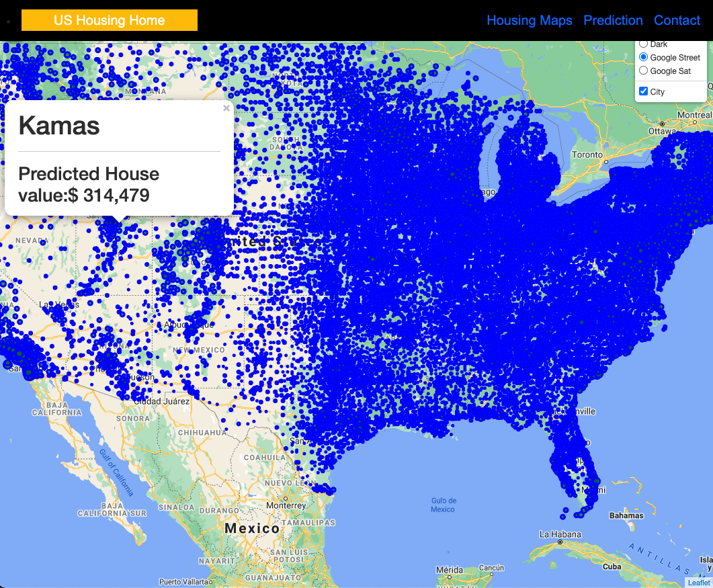
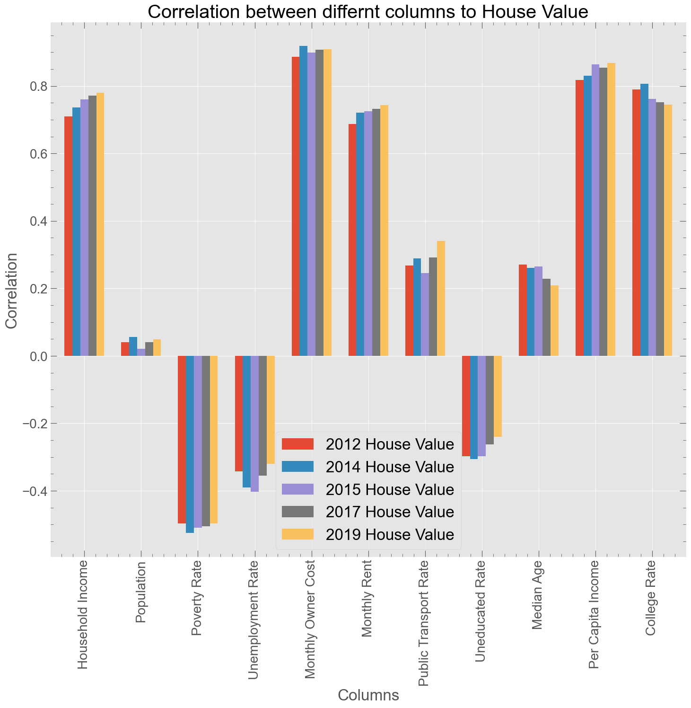
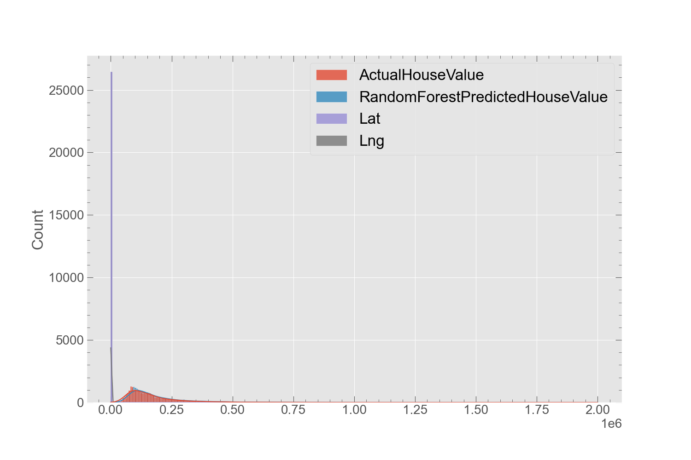
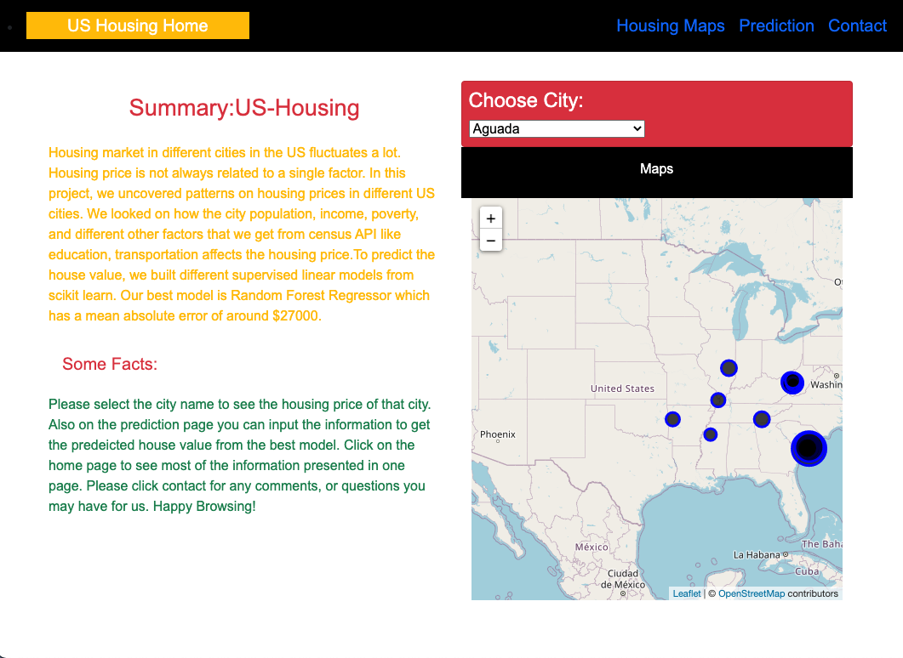
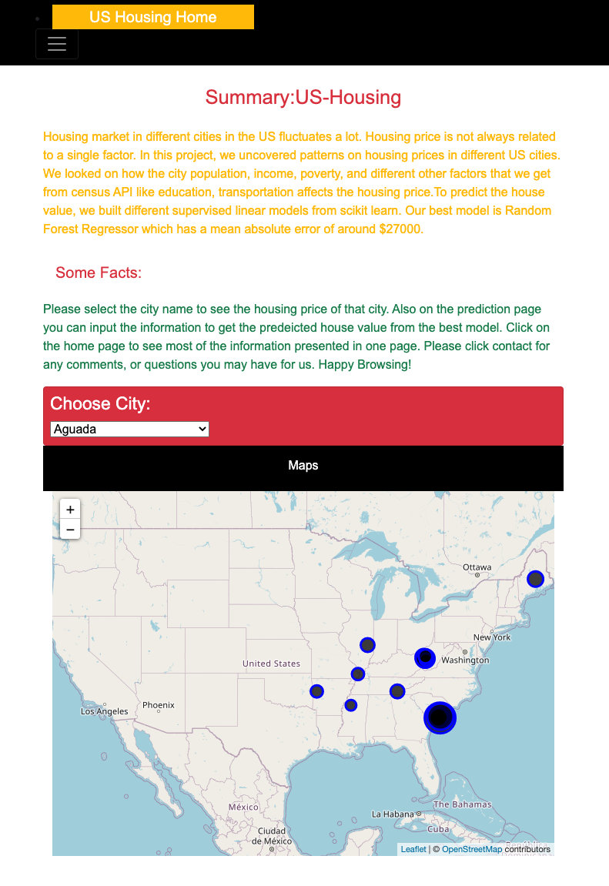
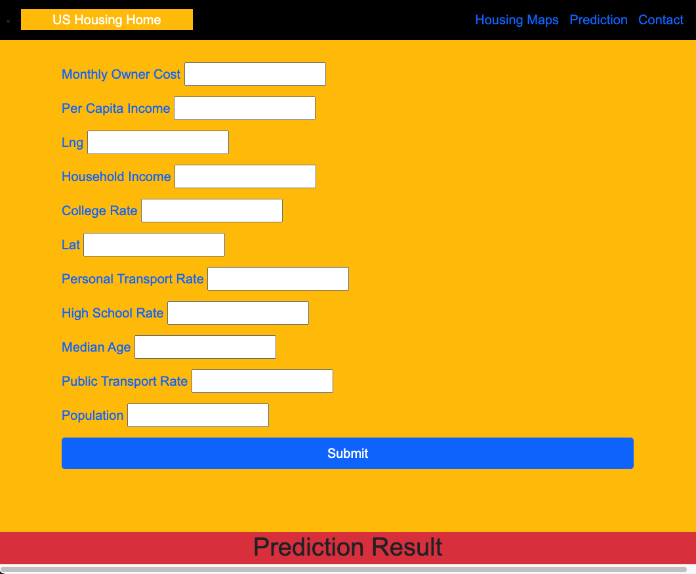
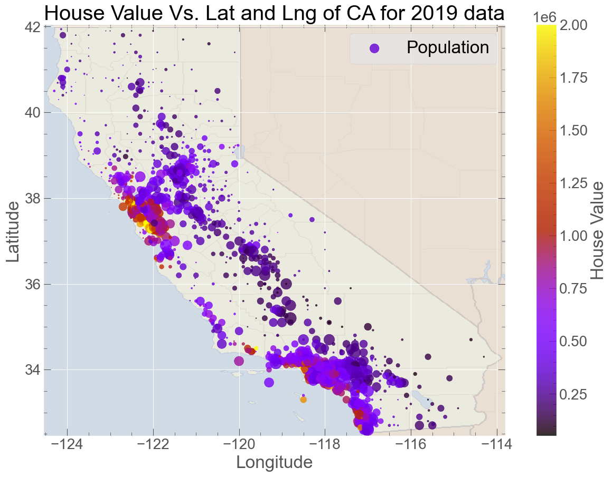
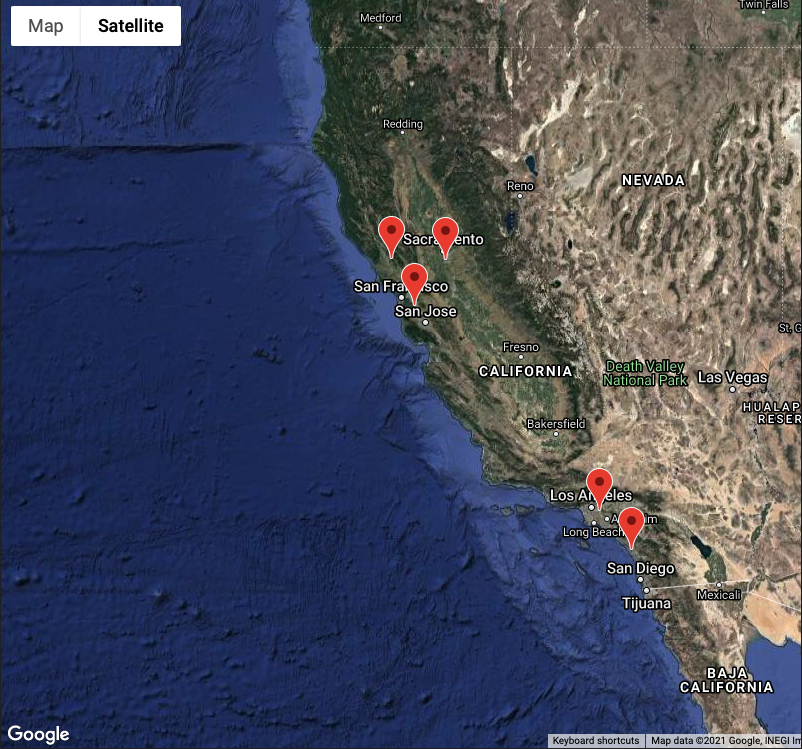

# housing-price-prediction

## Background
We used Census API to download the 5 years of US Census data and looked on the relationship of house price to other factors like economy, education, transportation and race. We get some interesting trend of house value on different years census data.  We build a model to predict the house value and our best model predicts the house value perfectly with an error of around $30,000. We also foused on California housing and see that the economy, education, and transportation are the important parameters for the housing value and recommended that these parameters other cities need to improve to be in the best city.

1. **Understanding the housing price correlation between different terms.**
We explored on housing price for different years from 2012 to 2019, and see slight increase in the county house value for each year. We plotted the correlation of housing price of different years data to different other factors as shown in Fig.

 From the figure, we can see a positive correlation with household income, population, monthly owner cost, monthly rent, public transportation, median people age, per capita income, and college rate. However, there is negative correlation of housing price with poverty rate, unemployment rate, and uneducated rate. We also see an important trend for different years data. The correlation of  housing price decrease for people median age and college rate for 2019 in compression to 2012 data, which means younger and less educated people are buying the house more in 2019.

I. **Model Building**
To predict the house value, we built different supervised linear models from scikit learn. Different models we worked on are as follows:
* Linear Regression
* Lasso Regression
* Ridge Regression Support
* Vector Machine Decision 
* Tree Regressor 
* Random Forest Regressor
Our best model is Random Forest Regressor which has a mean absolute error of around $27000.From our best model, we predicted the house value of unseen data from 2017. The actual house value and predicted house value from our best model is shown in Figure below.

 So our best model successfully predict the housing value of unseen data from 2017 Census with an prediction error of around $27,000.

II **- MongoDB and Flask Application**

We used MongoDB with Flask templating to create a new HTML page that displays all of the information about housing prediction.
* All the data is stored in mongoDB using pymongo.

* Created a different  routes  that query Mongo database and pass the data into an HTML template to display the data.

Creating a dashboard using HTML, CSS, javascript,and Bootstrap.
 These pages contained the visualizations and their corresponding explanations. There is a:

* A [landing page](#landing-page) containing:
  * An explanation of the project.
  * Can select city to see the housing values in the map
  
  * Small screen
  

* A Housing maps page, that contain:
  * A descriptive information of housing value of each city in US.
  

* A ["Prediction" page](#prediction-page) that:
  * Can predict the housing value from the our best model saved.
  

* A ["Contact" page](#contact-page):
  * Containing all the contact information.
  

2.**Understanding the Barriers of Affordable Housing in California**
We looked on how the city population, income, poverty, and different other factors that we get from census API like education, transportation affects the housing price. And from all these different factors, we nominated the best 5 cities to live in california.

a. **How Housing Prices related to other factors?**
At first, we want to uncover patterns on housing prices in different California cities and want to see how the housing price is related to other factors. For this, we looked on the most important parameters for the year 2019 which are as follows:

I. **Economy**

II. **Education**

III. **Transportation**

IV. **Race**

b. **Most Affordable 5 Cities of California**
Our team analyzed the best cities to live in based on certain criteria, for some it could be weather, cuisine or endless entertainment for family. Hence, we chose to analyze on some of the most important and common factors an individual would consider. After exploring all these different parameters, we nominated the best cities with the most common factors which are as follows:
* House Value 
* Income
* Cost/Rent
* Poverty
* Public Transport
* Employment/unemployment rate
We gave each parameter equal weight and nominated the best cities which satisfy most of the parameters above. 

We also plotted the best city using google maps API. As we can see, most best cities are in bay area and southern part of California.

**Data set**

   

   [USGS GeoJSON Feed](http://earthquake.usgs.gov/earthquakes/feed/v1.0/geojson.php) 

